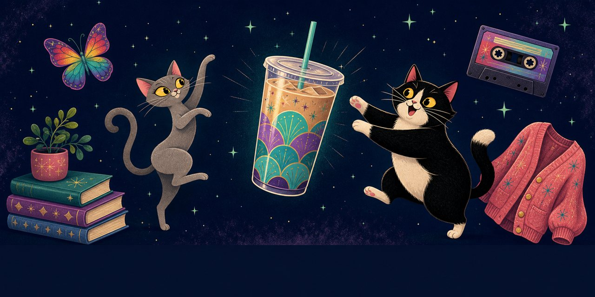

# Glee-fully Chai Chasers

**A personalized birthday game built around a genre Glee loves.**



**[Play Glee-fully Chai Chasers](https://okhp3.github.io/glee-fully-chai-chasers/)**

Joey and Phoebe are ready. The chai chase is on.

Glee-fully Chai Chasers is a free, original, mobile-first browser game of cascades, cats, iced chai, butterflies, and retro-bright midnight sparkle. Joey and Phoebe lead the Chai Chase through music, books, aurora, and other original keepsakes. It is made for Glee with fictional Glee-coins only—no purchases, accounts, ads, or cash-out.

## In the current build

The main game is a five-reel, four-row cascade board with 40 fixed paylines. Tap **SPARKLE!** to start a Chai Chase: winning symbols beam up, the reels settle, and the next cascade begins. Winning paths light up briefly, and an optional payline guide is available in Settings.

- **Firefly Cascade meter:** reach six cascades in a spin to start free spins.
- **Joey & Phoebe's Sparkle Wheel:** its three current modes are *We're Multiplying*, *Moonlit Keepsake Trail*, and *Iced Chai Wild Rain*. In *We're Multiplying*, one opening-result wild can carry a ×2, ×3, ×5, or ×10 badge and applies only to the lines that use it; cascade drops never create extra multiplier wilds.
- **Moonlit Keepsake Trail:** a 12-card memory match — six keepsake pairs dealt face down, up to two mismatches allowed — that awards 40 free spins once every pair is found.
- **Treat Jar and cat pop-ins:** Chicken Comets and Salmon Stars can call in Phoebe; Joey saves his stronger assist for Bougie Bites.
- **Treat Time:** Morning and Nighttime Treat Time sessions toss cat wilds onto the board before the cascades begin.
- **Doorbell Panic:** a matching pair of doorbells opens a cat-powered free-spin bonus.
- **Bold Chai:** a matching pair of chai pumps opens a 30-second iced-chai pump scene. Every completed 12-pump cup awards 3 free spins.
- **UniGlee:** the mythical rainbow butterfly is glimpsed often (a purely decorative sighting, ~1-in-850) but only truly caught rarely (~1-in-4,200) — a real capture opens the full multi-chapter marathon: 300, 400, or 500 free spins across Joey, Phoebe, and keepsake chapters, sized by which reel captures her, plus Phoebe's Lap Quest as an additive, timed sweetener.
- **Birthday Reveal:** a one-time, date-gated splash moment live across all of July, every year — Jamie's own message to Glee plus a Glee-coin bonus, once per device per year.
- **AskJamie perch:** tap once a day for a surprise coin top-up.

New games begin with 500 Glee-coins and a 1-coin wager, with a friendly automatic refill when needed. The game keeps its balance, settings, Treat Jar, and progress on the device. It includes the official illustrated AskJamie perch, separate music and sound controls, reduced motion, accessible labels, and a reset option.

## Still planned

These are approved directions, but they are not in the current build:

- Milestone scenes and the collection shelf.
- UniGlee marathon comfort features: pause/resume, fast mode, and a skip-to-summary option.
- Additional chapter-specific bonus presentation and the final music stems/mix.
- Service-worker/offline verification, asset optimization, and the device-regression gallery.

The existing Chai Tea shelf/pick-game concept is not represented as a shipped feature; Bold Chai is the current iced-chai bonus.

## Run it locally

```bash
npm ci
npm run dev
```

Useful checks:

```bash
npm run test
npm run build
```

The project is a Vite + TypeScript single-page app. Game math lives in `src/engine/`; the browser UI lives in `src/ui/`.

Current engineering status: the production build passes, the full test suite is green, and the seeded 200,000-spin oracle tracks the retuned base game. Everyday return-to-player (base plus the common bonuses — Treat Jar, Doorbell Panic, Bold Chai, Treat Time, and the Sparkle Wheel) measures ~96.5%, inside the 95–98% design band, with retriggers blocked engine-wide so no bonus can run away. UniGlee, the true marathon-granting capture (~1-in-4,200, distinct from the far more common ~1-in-850 decorative sighting), is intentionally excluded from that band: there's no real-money stake in this game, so its full-size 300/400/500-spin award is left generous on purpose, measuring ~103% full-game RTP at scale. The coins are supposed to never run out.

## Privacy and originality

Free. Fan-made. Fictional currency only, saved in your browser. **No wagering. No purchases. No ads. No accounts.** Limited Google Analytics measurement helps Jamie understand the game's aggregate reach; it does not track game play, create accounts, or enable advertising or personalization. See [Analytics & Privacy](./docs/ANALYTICS-PRIVACY.md).

All shipped art, sound, names, and game presentation are original. The project does not include photos of Glee, copyrighted clips or music, brand identities, or real-money gambling. See the [IP guardrails](./docs/IP-GUARDRAILS.md).

## Credits and project notes

**Glee:** the muse, the reason, the whole point.

**Joey and Phoebe:** the cats who lead the Chai Chase.

**Jamie:** creator and director.

For the product canon and collaboration guide, begin with [AGENTS.md](./AGENTS.md). The broader game story is in [docs/STORY.md](./docs/STORY.md), and the current approved implementation state is recorded in [docs/IMPLEMENTATION-BASELINE.md](./docs/IMPLEMENTATION-BASELINE.md).

---

*Inspired by Glee's sparkle, fueled by iced chai, and made with facts-on-facts love.*
