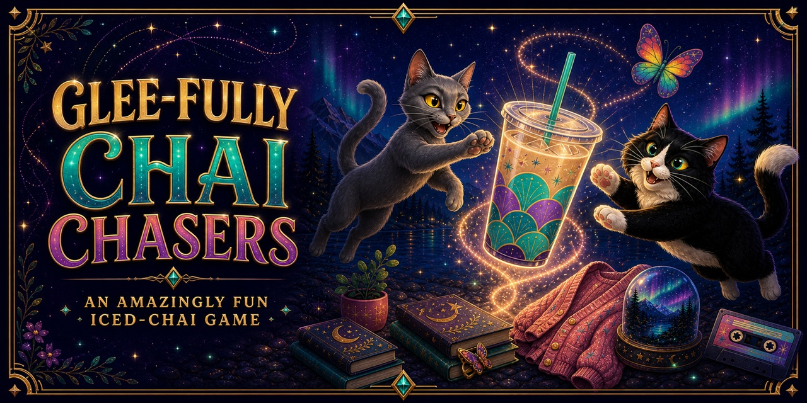

# Glee-fully Chai Chasers

**A personalized birthday game built around a genre Glee loves.**



**[Play Glee-fully Chai Chasers](https://okhp3.github.io/glee-fully-chai-chasers/)**

Joey and Phoebe are ready. The chai chase is on.

Glee-fully Chai Chasers is a free, original, mobile-first browser game of cascades, cats, iced chai, butterflies, and retro-bright midnight sparkle. Joey and Phoebe lead the Chai Chase through music, books, aurora, and other original keepsakes. It is made for Glee with fictional Glee-coins only. No purchases, accounts, ads, or cash-out.

## In the current build

The game opens on an illustrated splash. One tap unlocks audio and drops you into the cabinet: a five-reel, four-row cascade board with 40 fixed paylines, a marquee header, an illustrated firefly-jar meter, and a console-style bet bar. Tap **SPARKLE!** to start a Chai Chase. Winning symbols beam up, the reels settle, and the next cascade begins. Winning paths light up briefly, and an optional payline guide is available in Settings.

### The cascade loop

- **Firefly Cascade meter:** reach six cascades in a single spin to open free spins. The ladder pays 6, 9, 15, 25, 40, and 60 spins at six through eleven-plus cascades. Retriggers are blocked engine-wide, so no bonus can extend itself.
- **Keepsake Constellation:** a giant 2×2 keepsake can hold its place through a free-spin cascade chain while the surrounding board resolves.
- **Treat Jar and cat pop-ins:** Chicken Comets and Salmon Stars can call in Phoebe. Joey saves his assist for Bougie Bites. Filled treat sets cash out as free spins, one for chicken, two for salmon, three for bougie.

### The bonuses

- **Joey & Phoebe's Sparkle Wheel:** the free-spin wheel has three live wedges. *We're Multiplying*, *Moonlit Keepsake Trail*, and *Iced Chai Wild Rain*. In *We're Multiplying*, one opening-result wild can carry a ×2, ×3, ×5, or ×10 badge and applies only to the lines that use it. Cascade drops never create extra multiplier wilds.
- **Moonlit Keepsake Trail:** a dedicated twelve-card, six-pair memory screen in the reel stage. Two mismatches are allowed. Finding all six pairs hands off to 40 standard free spins.
- **Iced Chai Wild Rain:** a one-shot Wild Chai Storm. Every standard iced-chai symbol on the opening board of the session converts to a mermaid-cup wild. It does not repeat on cascades.
- **Treat Time:** Morning and Nighttime Treat Time sessions toss cat wilds onto the board before the cascades begin.
- **Doorbell Panic:** a matching pair of doorbells opens a cat-powered free-spin bonus of three to six spins, with Joey and Phoebe landing as wilds on payline coordinates each round.
- **Bold Chai:** a matching pair of chai pumps opens a 30-second iced-chai pump scene. Every completed 12-pump cup awards 3 free spins.
- **UniGlee:** the rare rainbow butterfly. Reels 3, 4, and 5 each roll their own independent capture at 1-in-2,500, 1-in-4,000, and 1-in-7,500, which is roughly one capture every 1,300 spins. The capturing reel sizes the award at 40, 60, or 80 free spins, and those spins play out as a five-act marathon: Joey's Laundry Helper first, then We're Multiplying, Keepsake Collection, and Nighttime Treat Time in seeded random order, with Phoebe's Lap Quest always last. Lap Quest adds its own spins and coins on top.

### The meta layer

- **Glee-coins and Chai Sparks.** New games begin with 500 Glee-coins and a 1-coin wager. Wager levels are 1, 2, 5, 10, 25, and 50, with the sixth level unlocking at player level 12. Every spin earns Chai Sparks, Sparks raise your player level, and the level badge lives in the cabinet marquee.
- **Bust-proof balance.** If the balance can't cover another spin, AskJamie finds coins under the couch and adds 500. The game cannot strand you.
- **Ice Notes.** A rotating ingredient almanac card sits under the board and becomes a full side panel on wide screens. Generic ingredients and preparation only, never a commercial recipe.
- **Birthday window.** Between July 17 and July 31, the splash carries Jamie's birthday message to Glee and 10,000 Glee-coins, once per device per year.

### Comfort, settings, and persistence

Separate music and sound-effect volumes with a master mute, a system/dark/light theme, reduced motion, an in-game paytable, accessible labels throughout, and a visible "start fresh" reset. Balance, bet, Sparks, Treat Jar, meter, and settings persist in versioned browser-local storage on the device. The PWA manifest and icons mean it installs to a phone home screen and launches full screen.

Every symbol, cat, saucer, jar, and wheel face on the shipped board is original inline SVG or original illustration. There is no emoji on the board.

## Still planned

These are approved directions that are not in the current build:

- Birthday Reveal scene, daily bonus, milestone scenes, and the collection shelf.
- UniGlee marathon comfort features: pause/resume, fast mode, skip-to-summary, and in-flight reload persistence.
- Additional chapter-specific bonus presentation and the final music stems and mix.
- Service-worker/offline verification and the saved device-regression gallery.

The Chai Tea shelf and pick-game concept is not a shipped feature. Bold Chai is the current iced-chai bonus.

## Run it locally

```bash
npm ci
npm run dev
```

Useful checks:

```bash
npm run test              # full Vitest suite, including the spec oracle
npm run validate:assets   # asset manifest and provenance gate
npm run build             # tsc --noEmit, then the Vite production build
```

The game is a Vite + TypeScript single-page app with no framework. Game math lives in `src/engine/` and stays free of DOM imports. The browser UI lives in `src/ui/`, owns presentation timing, and owns zero game math. Audio synthesis lives in `src/audio/`. `lib/`, `artifacts/`, and the pnpm workspace file are Replit workspace scaffolding for side artifacts such as the showcase video, and are not part of the shipped game bundle.

## Engineering status

Verified 2026-08-09 against `main`:

- **Tests:** 170 tests across 24 files, all green.
- **Build:** `tsc --noEmit` and the Vite production build both clean.
- **Spec oracle** (seeded 200,000-spin run in `src/engine/simulation.test.ts`, all six gates green): base-game RTP 61.08%, any win 1 in 3.15 spins, free spins 1 in 151, eight-plus cascade 1 in 980, UniGlee capture 1 in 1,370, cat pop-in 1 in 32.3.
- **Full-game RTP:** 95.66% measured end to end across 210,000 paid spins, using `scripts/sim-agent.ts` across seven independent seeds that play every bonus through the same engine entry points the UI uses. Base game contributes 60.79% and the bonus layer contributes 34.87%. Per-seed totals ranged from 90.7% to 100.4%, which is the honest variance of a game whose rarest event is worth roughly six points of RTP on its own. The target band is 95% to 98%.
- **Runaway check:** zero capped bonus sessions across the fleet, confirming the engine-wide retrigger block holds.

The oracle is a deliberately strict gate. It was written to fail, and it is not weakened to reach green.

## Privacy and originality

Free. Fan-made. Fictional currency only, saved in your browser. **No wagering. No purchases. No ads. No accounts.** Limited Google Analytics measurement helps Jamie understand the game's aggregate reach. It does not track game play, create accounts, or enable advertising or personalization. See [Analytics & Privacy](./docs/ANALYTICS-PRIVACY.md).

All shipped art, sound, names, and game presentation are original. The project does not include photos of Glee, copyrighted clips or music, brand identities, or real-money gambling. See the [IP guardrails](./docs/IP-GUARDRAILS.md).

## Credits and project notes

**Glee:** the muse, the reason, the whole point.

**Joey and Phoebe:** the cats who lead the Chai Chase.

**Jamie:** creator and director.

For the product canon and collaboration guide, begin with [AGENTS.md](./AGENTS.md). The broader game story is in [docs/STORY.md](./docs/STORY.md), settled rulings are in [docs/DECISION-LOG.md](./docs/DECISION-LOG.md), and the tool-handoff authority map is in [docs/IMPLEMENTATION-BASELINE.md](./docs/IMPLEMENTATION-BASELINE.md). Where a document and the code disagree, the code and its tests are the evidence. A specification is not proof that its feature shipped.

The engineering case study, including the multi-agent governance pattern behind the build, lives at [overkillhill.com/projects/glee-fully-chai-chasers](https://overkillhill.com/projects/glee-fully-chai-chasers/). The player-facing home is [glee-fully.tools/arcade](https://glee-fully.tools/arcade/).

---

*Inspired by Glee's sparkle, fueled by iced chai, and made with facts-on-facts love.*
